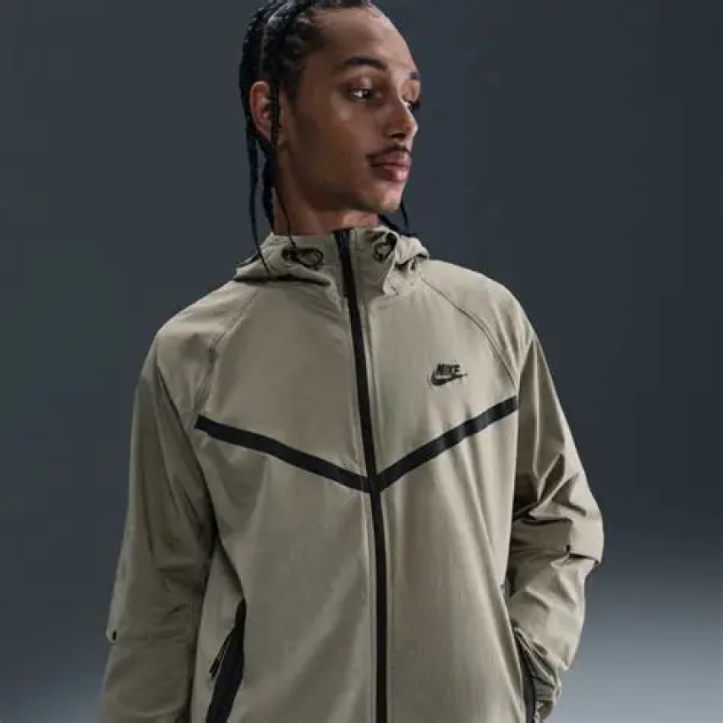
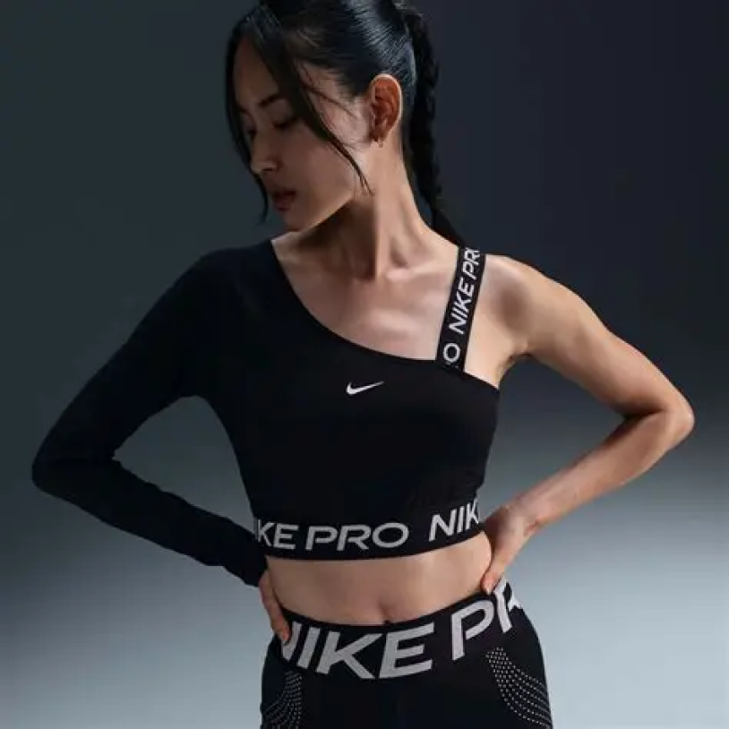
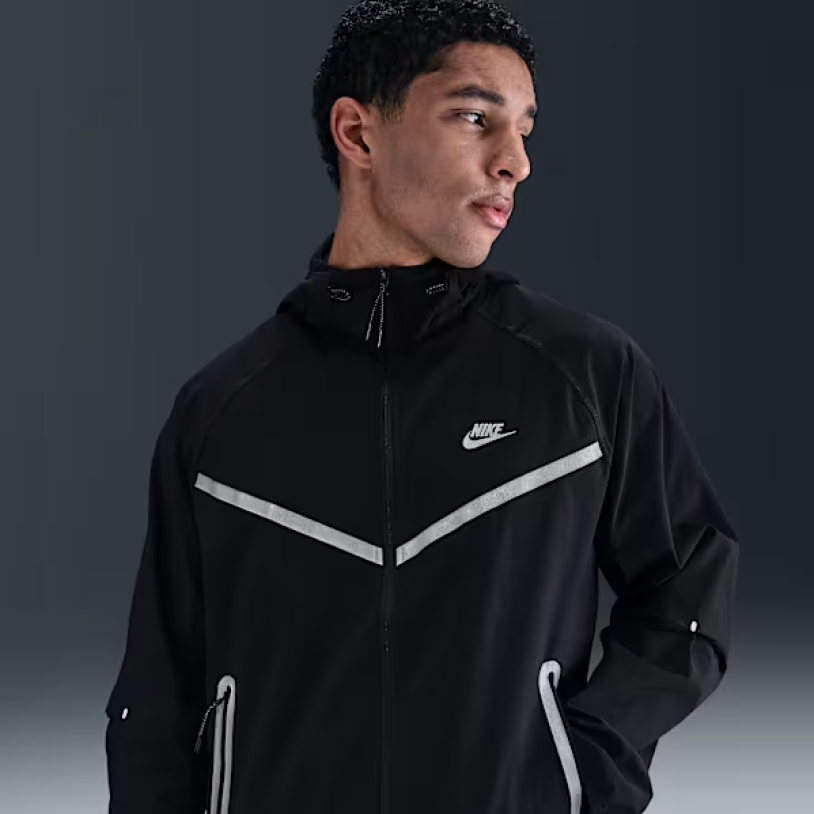
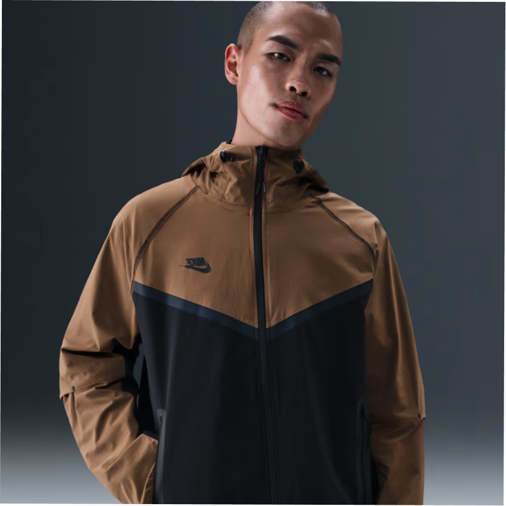

# Tarea-3.1-Frame-CSS
<!DOCTYPE html>
<!--codigo para ejutar Tailwind:  npx @tailwindcss/cli -i ./style.css -o ./dist/output.css --watch-->
<head>
    <meta charset="UTF-8">
    <meta name="viewport" content="width=device-width, initial-scale=1.0">
    <link href="output.css" rel="stylesheet">
    <title>Urban Kickz</title>
</head>
<body>
    <header class="bg-white p-3.5 flex items-center justify-between shadow-sm">
    

        
    

    <nav>
        <ul class="flex items-center gap-8 ">
            <li><a href="#" class="text-sm font-semibold text-gray-900 hover:text-gray-600">Productos</a></li>
            <li><a href="#" class="text-sm font-semibold text-gray-900 hover:text-gray-600">Acerca de</a></li>
            <li><a href="#" class="text-sm font-semibold text-gray-900 hover:text-gray-600">Contáctanos</a></li>
        </ul>
    </nav>
</header>
<h1 class="font-extrabold text-5xl flex justify-center mt-9">Lo Más Vendido</h1>
<h1 class="text-1xl flex justify-center text-gray-500 mt-2.5">Mira nuestros produtos mas buscados por nuestros clientes</h1>

<button class="bg-black  hover:bg-gray-800 text-white rounded py-2 px-4"><strong>Comprar</strong></button>

<button class="bg-gray-50 hover:bg-gray-200 rounded py-2 px-4 "><strong>Carrito</strong></button>

    

        
        

            
            
            
            
        

        

            
            
            
            
        

        
    

    <h2 class="text-2xl md:text-3xl font-extrabold text-black mb-10 text-center md:text-left">
        Lo Más Vendido
    </h2>

    

        
        

            

                
            

            

                <h3 class="text-sm font-bold text-black leading-tight">
                    Equipo México Mundial Clásico Baseball 2026 (blanco)
                </h3>
                
$2,999

            

        

        

            

                
            

            

                <h3 class="text-sm font-bold text-black leading-tight">
                    Equipo México Mundial Clásico Baseball 2026 (verde)
                </h3>
                
$2,999

            

        

        

            

                
            

            

                <h3 class="text-sm font-bold text-black leading-tight">
                    Tenis Nike Air Force One (AF1)
                </h3>
                
$2,999

            

        

        

            

                
            

            

                <h3 class="text-sm font-bold text-black leading-tight">
                    Tenis Nike Air Force 1 '07 Premium +
                </h3>
                
$2,999

            

        

    

<footer class="mt-24 pt-12 pb-16 px-6 border-t border-gray-200 max-w-7xl mx-auto">
    

        
        

            <h3 class="text-lg font-bold text-black mb-4">Terminos & Condiciones</h3>
            

                Al acceder y utilizar este sitio web, usted acepta cumplir con nuestros
                términos de servicio. Urban Kickz se reserva el derecho de actualizar
                estos términos en cualquier momento para reflejar cambios en nuestras
                operaciones o regulaciones legales.
            

        

        

            <h3 class="text-lg font-bold text-black mb-4">Contactanos</h3>
            <ul class="text-sm text-gray-500 flex flex-col gap-3">
                <li><a href="mailto:urbankickz2026@gmail.com" class="hover:text-black transition-colors">urbankickz2026@gmail.com</a></li>
                <li><a href="#" class="hover:text-black transition-colors">@Urban_Kickz_26</a></li>
                <li><a href="#" class="hover:text-black transition-colors">Linkedin</a></li>
            </ul>
        

        
    

</footer>
</body>
</html>
